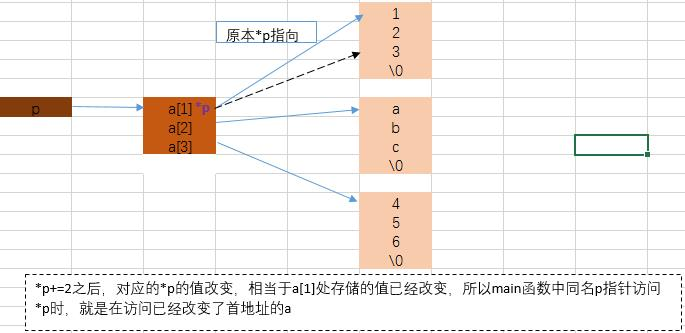

+++
author = "Muzi"
title = "嵌入式软件笔试——基础"
date = "2025-07-28"

+++


# 嵌入式软件笔试面试

## 如何使用C语言实现读写寄存器变量？

>寄存器通常用于访问硬件设备的控制、状态和数据。在C语言中，读写寄存器通常**通过指针操作或者定义宏**来实现。
>
>#### 1.使用指针直接访问寄存器地址
>
>假设你有一个硬件寄存器的地址，你可以定义一个指针来访问整个地址。
>
>```c
>// 假设寄存器的地址是0x40021000
>#define REGISTER_ADDRESS 0x40021000
>
>// 定义一个指向寄存器的指针
>volatile uint32_t* register_ptr = (volatile uint32_t*)REGISTER_ADDRESS;
>//volatile关键字在这里的使用是为了确保对硬件寄存器的每次访问都是直接且即时的
>
>// 写寄存器
>*register_ptr = 0x12345678;
>
>// 读寄存器
>uint32_t value = *register_ptr;
>```
>
>#### 2.使用宏定义
>
>使用宏定义可以使代码更具可读性和维护性。
>
>```c
>// 假设寄存器的地址是0x40021000
>#define REGISTER_ADDRESS 0x40021000
>
>// 定义寄存器访问的宏
>#define REG_WRITE(addr, value) (*(volatile uint32_t*)(addr) = (value))
>#define REG_READ(addr) (*(volatile uint32_t*)(addr))
>
>// 写寄存器
>REG_WRITE(REGISTER_ADDRESS, 0x12345678);
>
>// 读寄存器
>uint32_t value = REG_READ(REGISTER_ADDRESS);
>```
>
>#### 3.使用结构体映射寄存器地址
>
>如果寄存器有多个，并且它们连续排列，可以使用结构体来映射这些寄存器。
>
>```c
>// 假设寄存器的基地址是0x40021000
>#define BASE_ADDRESS 0x40021000
>
>// 定义寄存器结构体
>typedef struct {
>	volatile uint32_t REG1;
>	volatile uint32_t REG2;
>	// 其他寄存器...
>} RegisterMap;
>
>// 定义指向寄存器基地址的指针
>RegisterMap* regmap = (RegisterMap*)BASE_ADDRESS;
>
>// 写寄存器
>regmap->REG1 = 0x12345678;
>regmap->REG2 = 0x87654321;
>
>// 读寄存器
>uint32_t value1 = regmap->REG1;
>uint32_t value2 = regmap->REG2;
>```
>
>**volatile关键字**：在访问硬件寄存器时，一定要使用`volatile`关键字，以防止编译器优化掉对寄存器的访问。

## C语言计算绝对值

>#### 1.计算整数的绝对值
>
>```c
>#define ABS(x) ((x)< 0 ? -1 * x : x)
>```
>
>#### 2.计算浮点数的绝对值
>
>```c
>float my_fabs(float fnumber)
>{
>	*( (int *) &fnumber) &=0x7FFFFFFF;
>	return fnumber;
>}
>//取得浮点数的地址，然后把符号位置0。
>```

## 宏函数

>#### 1.判断一个整数是有符号数还是无符号数
>
>```c
>#define is_unsigned(a) ((a >= 0)&&(~a >= 0))
>//a代表一个数值，如果a>0并且取反之后也是大于0，那么就是无符号
>```
>
>#### 2.得到指定地址上的一个字节或字
>
>```c
>#define MEM_B(x)(*((byte *)(x)))
>#define MEM_W(x)(*((word *)(x)))
>```
>
>#### 3. 求较大值和较小值
>
>```c
>#define MAX(x,y)((x)>(y)? (x): (y))
>#define MIN(x,y)((x)<(y)? (x): (y))
>```
>
>#### 4.将一个字母转换成大写
>
>```c
>#define UPCHAR(ch) ((ch)>='a'&&(ch)<='z'? ((ch)-'a'+'A'):(ch))
>```
>
>#### 5.宏函数的副作用
>
>```c
>#define MIN(A,B) ((A)<=(B)?(A):(B))
>1）三目运算符使编译器能产生比if-else更优化的代码
>2）在宏中小心地把参数用括号括起来
>3）宏的副作用，例如：当你写下面的代码时会发生什么事？
>
>least = MIN(*p++, b); 
>//展开宏：least = ((*p++)< (b)? (*p++): (b));
>//问题在于这里*p++被使用了两次，导致程序的结果不是我们期待的那用
>//解决：
>int temp = *p++; 
>least = MIN(temp, b); 
>```

## 数据类型转换

>#### 1. char和int之间的转换
>
>- 将"char"转换成"int“:
>
>对于`char`到`int`的转换，因为`int`类型通常比`char`类型有更宽的表示范围（能够存储更大的值），所以这种转换是安全的，并且经常被编译器自动执行。
>
>```c
>显式地将char转换为int:
>char c = 'A'; 
>int i = (int)c; 
>
>隐式地将char转换为int:
>char c = 'A';
>int i = c+1;
>//C在表达式c+1中被隐式地提升为int型。
>
>int i = c;
>//当char类型地值被赋值给int的变量时,也会发生隐式转换。
>```
>
>- 将"int"转换为"char"：
>
>这可能会导致数据丢失，因为int类型的范围远大于char。如果int的值超出了char的表示范围，结果将是未定义的，但通常会根据具体的实现和编译器的行为，将值截断到char能表示的范围内。
>
>```c
>int i = 65; // ASCII码中的'A'
>char c = (char)i; //显式地将int转换为char
>
>int i = 256; //对于char来说，这个值太大了
>char c = (char)i; //显式转换
>
>//假设char是无符号的,其表示范围为0-255，那么c的值将是 256%256 = 0。
>```
>
>#### 2.整数自动转换：同时存在有符号类型和无符号类型时，自动转换成无符号类型
>
>例1.
>
>```c
>下面代码输出的是什么？
>void foo(void)
>{
>	unsigned int a = 6; 
>	int b = -20; 
>	(a+b > 6)? puts("> 6"): puts("<= 6"); 
>}
>```
>
>**C语言中的整数自动转换原则。**不管如何，这个问题的答案输出是“>6”。原因是当表达式中存在有符号类型和无符号类型时，所有的操作数都自动转换为无符号类型。因此-20变成了一个非常大的正整数，所以该表达式计算出的结果大于6。
>
>例2.
>
>```c
>下面的代码输出又是什么？
>int main()
>{
>	int a = -7; 
>	unsigned int b = 3;
>	if((a + b)> 0)
>	{
>			printf("+\n");
>	}	
>	printf("%u\n",a + b);
>	printf("%d\n",a + b); 
>	return 0;
>}
>
>输出：
>+
>4294967289 
>-4
>```
>
>解析：在进行a+b的加法运算时，有符号整型a会被隐式地转换成无符号类型，以便与无符号整型b进行运算。因此-7被转换为无符号整型，其值变得非常大（具体值取决于unsigned int在系统中的位宽，假设是32位，则-7转换为无符号整型后的值是4294967289，即2^32 -7）。由于a + b的结果是一个非常大的无符号整数（4294967292），它自然大于0，因此条件判断为真，执行printf("+\n");，输出+。
>
>以无符号整型的形式输出a + b的结果，即4294967292。
>
>尽管a + b的结果是以无符号整型的形式计算的，但这里使用%d格式说明符来输出一个有符号整型。由于结果非常大，超出了int类型的表示范围（假设是32位系统），这里会发生整数溢出，实际输出值将是这个无符号数对int类型表示范围取模后的结果。在大多数现代系统上，将4294967292对2^31(4294967296)取模后，再加上负号，因为int通常是以二进制补码形式存储的）。

## 编程题

>#### 1.写一段代码，可以将输入为”0.0.0.0”—“255.255.255.255”的字符串转换为int型整数数组。输入：”255.255.255.255”输出：255 255 255 255 （数组）
>
>```c
>#include <stdio.h> 
>#include <stdlib.h> 
>#include <string.h> 
>
>#define MAX_NUM_LEN 16 
>
>int main()
>{
>	char input[MAX_NUM_LEN]; 
>	int nums[4]; 
>	char *token;
>	int i; 
>
>	printf("请输入一个IP地址（0.0.0.0-255.255.255.255）："); 
>	scanf("%s", input); 
>
>	//初始化token为input，用于第一次调用strtok
>	token = strtok(input,".");
>
>	//将字符串按点号分割为整数数组
>	for (i = 0; i < 4; i++)
>	{
>//字符串转换成整数
>		nums[i]= atoi(token); 
>		//传入NULL以继续从上次的位置分割
>		token = strtok(NULL,".");
>	}
>
>	//输出整数数组
>	printf("%d %d %d %d\n", nums[0], nums[1], nums[2], nums[3]); 
>
>	return 0; 
>}
>```
>
>该程序首先定义了一个字符数组input和一个整数数组nums，用于存储输入的字符串和转换后的整数。然后，程序提示用户输入一个IP地址，并使用scanf函数将其存储到input数组中。接下来，程序使用strtok函数将输入的字符串按点号分割为四个部分，并将每个部分转换为整数，存储到nums数组中。注意，每次调用strtok函数后，需要将input置为NULL，以避免重复使用strtok函数。

## 代码找错

>#### 1.下面的函数有什么错误
>
>```c
>int square(volatile int *ptr)
>{
>	return *ptr * *ptr; 
>}
>
>```
>
>这段代码的目的是用来返回指针\*ptr指向值的平方，但由于*ptr指向的是一个volatile型参数，编译器将产生类似下面的代码：
>
>```c
>int square(volatile int *ptr)
>{
>	int a,b; 
>	a = *ptr; 
>	b = *ptr; 
>	return a * b; 
>}
>```
>
>由于*ptr的值可能被意想不到地改变，因此a和b的值可能是不同的。结果就是这段代码可能返回就是两个不同数的乘积，而不是你所期望的平方值！正确的代码如下：
>
>```c
>long square(volatile int *ptr)
>{
>	int a; 
>	a = *ptr; 
>	return a * a; 
>}
>```
>
>#### 2.请问以下代码有什么问题
>
>```c
>int main()
>{
>	char a;
>	char *str=&a; 
>	strcpy(str,"hello");
>	printf(str);
>	return 0;
>}
>```
>
>1.试图将一个指向这个字符的指针str传递给strcpy 函数，以复制字符串"hello"。将一个字符串复制进一个字符变量指针所指地址。虽然可以正确输出结果，但因为越界进行内存读写而导致程序崩溃。
>
>2.printf函数期望第一个参数是一个格式字符串，后跟要打印的变量。
>
>```c
>修改：
>int main()
>{
>	char *str =(char *)malloc(6); //分配足够的空间来存储"hello"和'\0'
>	if (str == NULL){
>		//如果内存分配失败，则输出错误并退出
>		printf("Memory allocation failed\n"); 
>		return 1; 
>	}
>
>	strcpy(str,"hello"); //现在可以安全地复制字符串了
>	printf("%s\n", str); //使用%s 来打印字符串
>
>	free(str); //使用完毕后释放内存
>	return 0; 
>}
>```
>
>#### 3.请问以下代码有什么问题
>
>```c
>char *s="AAA";
>printf("%s",s);
>s[0]='B';
>printf("%s",s);
>```
>
>在C语言中，字符串常量（如"AAA"）通常存储在只读内存区域中。当您使用 char* s = "AAA"; 时，s是一个指向这个只读内存区域中"AAA"字符串的指针。尝试修改这个区域中的任何内容（如 s[0]= 'B';）都是非法的，并且可能导致程序崩溃或其他不可预测的行为。为了安全地修改字符串，您应该使用字符数组而不是指向字符串常量的指针。
>
>```c
>正确做法：
>char s[]= "AAA"; 
>printf("%s", s); 
>s[0]= 'B'; 
>printf("%s", s);
>```

## 代码阅读

>#### 1.以下程序运行时输入：123456789则程序运行结果是？
>
>```c
>#include <stdio.h>
>int main()
>{
>	int x, y;
>	scanf("%2d%*4s%2d",&x,&y);
>	printf("%d", y - x);
>	return 0;
>}
>```
>
>%\*4s表示读取一个长度为四个字符的字符串，中间的\*表示将读取到的字符串忽略，不赋给变量列表中的变量。将输入的前两位给x，跳过中间的四个字符，将之后的两位给y。所以x=12，y=78。答案：66。
>
>#### 2.**阅读下面代码，程序会打印出来的值是？**
>
>```c
>#include <stdio.h>
>void f(char **p)
>{
>	*p += 2;
>}
>
>void main()
>{
>	char *a[]= {"123","abc","456"},**p;
>	p = a;
>	f(p);
>	printf("%s",*p); //3
>}
>```
>
>
>
>定义了一个字符指针数组a，包含三个字符串常量“123”、“abc”、“456”。p是指向字符指针的指针。


