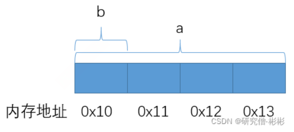
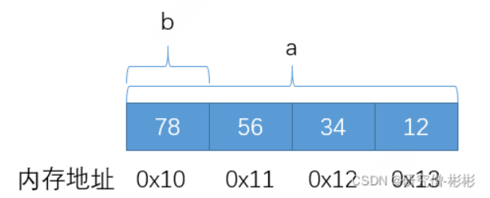
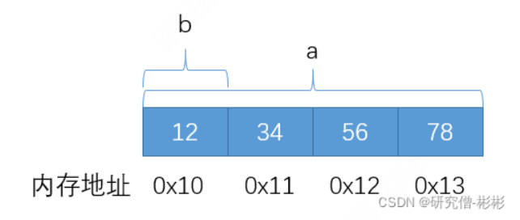

+++
author = "Muzi"
title = "C语言——杂项"
date = "2025-07-29"

+++


#  C语言-杂项

## 原码、反码、补码

>在计算机中，数值的表示通常涉及**原码、反码和补码**。对于**正数**，其原码、反码和补码的表示形式是**完全相同**的。
>
>**1. 原码（Sign-Magnitude）**
>
>-   最高位表示符号（`0` 为正，`1` 为负），其余位表示数值。
>-    `+5` 的 8 位原码：`00000101`
>-    `-5` 的 8 位原码：`10000101`
>
>原码中，0有两种表示方式：+0（0000...00）和-0（1000...00），这在某些情况下可能引发歧义。
>
>**2. 反码（Ones' Complement）**
>
>-   **正数**的反码 = **原码**（符号位不变，数值位不变）。
>-   **负数**的反码 = **符号位不变，数值位按位取反**。
>-   `+5` 的反码：`00000101`（与原码相同）
>-    `-5` 的反码：`11111010`（符号位不变，数值位取反）
>
>**3. 补码（Two's Complement）**
>
>-   **正数**的补码 = **原码**（与反码相同）。
>-   \- **负数**的补码 = **反码 + 1**
>-    `+5` 的补码：`00000101`（与原码相同）
>-   `-5` 的补码：`11111011`（反码 `11111010` + `1`）
>
>补码是在反码的基础上，对数值位（不包括符号位）加1得到的。正数的补码与原码相同，负数的补码是在其反码的基础上+1。补码中，0只有一种表示方式（0000...00），消除了原码码中+0和-0的区分。
>
>**结论**
>
>-   **正数的反码 = 原码**，因为正数的表示方式不需要变化。
>-   **负数的反码 = 符号位不变，数值位取反。**
>-   **计算机通常使用**补码**存储整数，因为它可以统一加减法运算，并避免 `+0` 和 `-0` 的问题。
>
>| 十进制数 | 原码       | 反码       | 补码       |
>| -------- | ---------- | ---------- | ---------- |
>| +5       | `00000101` | `00000101` | `00000101` |
>| -5       | `10000101` | `11111010` | `11111011` |
>
>因此，**正数的反码确实与原码相同**，而负数的反码需要按位取反（除符号位）。

## 字节序

>#### 1.大端（Big-endian和小端（Little-endian）
>
>采用Little-endian模式的CPU对操作数的存放方式是从低字节到高字节，而Big-endian模式对操作数的存放方式是从高字节到低字节。
>
>例如，16bit宽的数0x1234在Little-endian模式CPU内存中的存放方式（假设从地址0x4000开始存放）为：
>
>```c
>内存地址	 存放内容
>0x4001	   0x12
>0x4000	   0x34
>
>而在Big-endian模式CPU内存中的存放方式则为：
>内存地址	存放内容
>0x4001	  0x34
>0x4000	  0x12
>//存储地址一定是从低内存地址往高内存地址移动。
>//如果先存储的是低字节数据，就是小端模式
>//如果先存储的是高字节数据，就是大端模式
>```
>
>#### 2.联合体判断大小问题
>
>```c
>typedef union{
>	int a; //4字节
>	char b; //1字节
>}myunion;
>
>myunion test; //test内存大小取它们最大的值4字节
>```
>
>
>
>如图所示，a和b靠地址较小一边对齐，a和b共用一段内存。如果对a赋值，影响了4个字节内存，如果对b赋值，影响了1字节内存，所以不管对谁赋值，都会影响另外一个。刚好我们可以根据这个特点，去判断大小端。
>
>```c
>test.a = 0x12345678;
>
>if (test.b == 0x78){printf("小端模式")；}
>else if (test.b == 0x12){printf("大端模式")；}
>```
>
>如果是小端模式，那么a的低字节0x78就应该放在低地址，所以此时用test.b读出来的刚好是0x78。
>
>
>
>如果是大端模式，那么a的高字节0x12就应该放在低地址，所以此时用test.b读出来的刚好是0x12。
>
>
>
>#### 3.不用联合体的方法——指针
>
>```c
>int main()
>{
>	unsigned int i = 0x1234;
>	char *c = (char*)&i;
>
>	if(*c == 0x34)
>	{
>		printf("Little Endian\n");
>	}
>	else
>	{
>		printf("Big Endian\n");
>	}
>
>	return 0;
>}
>```
>
>#### 4.大小端转换问题
>
>这里主要是位移操作，比如对于一个32位进行大小端转换。思路：把0-7位移动到24-31；8-15位移动到16-23；16-23位移动到8-15位；24-31位移动到0-7。
>
>```c
>int swap(int value)
>{
>int temp =0;
>	temp=((value &0x000000ff)<<24)|
>	((value &0x0000ff00)<<8)|
>	((value &0x00ff0000)>>8)|
>	((value &0xff000000)>>24);
>	return temp;
>
>```
>
>

## 位域

